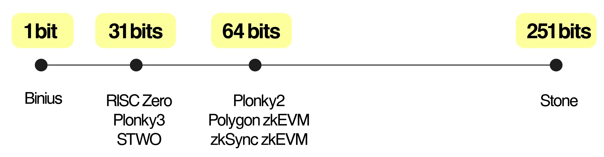

# 楕円曲線

楕円曲線の歴史は非常に長くて、第二世紀で既にDiophantusの本に記載されています。暗号学に楕円曲線を利用するのは２０世紀の話です。

<figure><figcaption></figcaption></figure>

## 数学の楕円曲線

楕円曲線は $$y^2=x^3+ax+b$$ で表現されます。

注意すべき点は、 $$\Delta = 4a^3+27b^2 \neq 0$$ が必要であります。

楕円曲線自体は滑らかで、 $$a,b$$ の値でさまざまな形になりますが、暗号学で楕円曲線を利用する場合は、有限体上の楕円曲線の点の集合を利用します。

## 有限体上の楕円曲線の整数点の集合 (Elliptic Curve over Finite Fields)

暗号学で利用するときは精度を重視するため、整数有限体上の楕円曲線を利用します。 $$p>3$$ を素数とする。有限体 $$F_p$$ 上の楕円曲線 $$E$$: $$y^2=x^3+ax+b \pmod p$$ の点の集合は下記の性質を満たします：

<table><thead><tr><th width="161">群の性質</th><th></th></tr></thead><tbody><tr><td>元 (Element)</td><td>y^2=x^3+ax+b \pmod p の解  (x,y) \in \mathbb Z_p \times \mathbb Z_p 全体の集合</td></tr><tr><td>単位元 (Identity Element)</td><td>無限遠点(point at infinity) O P \in E について、 P+O=O+P=P と定義する</td></tr><tr><td>逆元 (Inverse Element)</td><td>(x,y) \in E についての逆元を (x, -y) とする</td></tr><tr><td>加算</td><td>P=(x_1, y_1),Q(x_2,y_2) を E 上の点とする。 もし x_1 = x_2 かつ y_1 = -y_2 ならば P+Q=O でなければ P+Q=(x_3,y_3) \in \mathbb Z_p \times \mathbb Z_p とする \begin{aligned} x_3 &#x26;= \lambda^2 - x_1 - x_2 \pmod{p} \\ y_3 &#x26;= \lambda(x_1 - x_3) - y_1 \pmod{p} \\ \lambda &#x26;=  \begin{cases} \frac{y_2 - y_1}{x_2 - x_1} \pmod{p} &#x26; \text{if } P \neq Q \\[1ex] \frac{3x_1^2 + a}{2y_1} \pmod{p} &#x26; \text{if } P = Q \end{cases} \end{aligned}</td></tr><tr><td>二倍算</td><td>P=(x_1,y_1),Q=(x_2,y_2) \in E, Q=2P=P+P の場合は若干特殊で \begin{aligned} \begin{cases} x_2 &#x26;= (\frac{3x_1^2+a}{2y_1)^2 - 2x_1})\\ y_2&#x26;=y_1+(\frac{3x_1+a}{2y_1})(x_2-x_1) \end{cases} \end{aligned} で計算します</td></tr><tr><td>スカラー倍算</td><td>
P=(x_1,y_1), Q=(x_2,y_2) \in E, Q=nP=\underbrace{P+P+...+P}_\text{n回} の場合、スカラー倍算と呼びます。 P,Q \in E が知っている上で、 Q=nP を満たす n を求める問題を、楕円曲線離散対数問題と呼びます。  \underbrace{P+P+...+P}_\text{n回}P を n 回足し算するより、 n を2の倍数に変改して加算した方が効率的です 例 \underbrace{P+P+...+P}_\text{n回}n=7 の場合: 

\begin{aligned} n &#x26;=1+2+4=2^0+2^1+2^2 \\ 2^1P &#x26;=2^0P+2^0P=P+P=2P \\ 2^2P &#x26;=2^1P+2^1P=2P+2P=4P \end{aligned} \begin{aligned} Q  &#x26;=nP =(2^0+2^1+2^2)P \\ &#x26;=2^0P+2^1P+2^2P \\ &#x26;=P+2P+4P=7P \end{aligned}で計算できます
</td></tr><tr><td>マルチスカラー倍算</td><td>P_1,...,P_n を楕円曲線の点、 x_1,...,x_n を有限体の点としたとき Q=x_1P_1+...+x_nP_n を求めることをマルチスカラー倍算と呼びます。  SNARKなどで頻繁的に利用されているが、計算量は多いです。効率化に関する研究は現在進行形です。</td></tr></tbody></table>

参考資料

[https://zenn.dev/herumi/articles/ecc-multi-scalar-multiplication](https://zenn.dev/herumi/articles/ecc-multi-scalar-multiplication)

[https://tex2e.github.io/blog/crypto/point-of-elliptic-curve-over-GF](https://tex2e.github.io/blog/crypto/point-of-elliptic-curve-over-GF)

[https://andrea.corbellini.name/ecc/interactive/modk-add.html](https://andrea.corbellini.name/ecc/interactive/modk-add.html)
