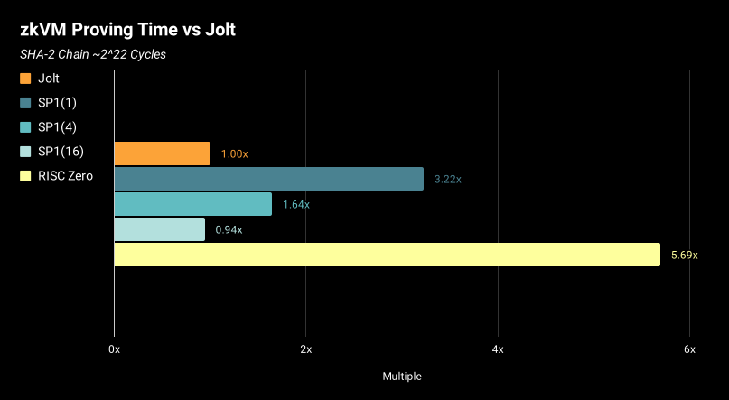

# Jolt

Jolt (Just one Lookup Table)はa16z CryptoのArasu Arun、Srinath Setty、Justin Thalerによって開発されたRISC-V命令セットアーキテクチャ用のゼロ知識仮想マシン(zkVM)です。SP1やRISC-Zeroと比べ実装がシンプルです。

JoltのコアアイデアはルックアップテーブルとSumcheck Protocolで、それらを組み合わせることで回路サイズを抑え、証明を高速化しています。

### VMにおけるRustプログラム実行の流れ

まず、Rustプログラムをrusrcなどのコンパイラを用いて機械語にコンパイルするとELFなどのバイトコードが生成されます。このバイトコードを直接VM上で実行します。

VMでの実行のはじめに、バイトコードは命令ごとのアドレスが区切られて仮想メモリに展開されます。

各実行では、以下が命令ごとに繰り返されます。

1. 命令を仮想CPUのレジスターにフェッチ
2. 命令をデコード
3. 命令を実行
4. 実行結果をメモリに書き込み

実行が終わったらメモリから結果が帰ってきます。

### Joltのコンポーネント

VMにおける上記の(1)\~(4)の処理が正しく行われていることを証明するために、4つのコンポーネントがあります。

1. 追加のR1CS: プログラムカウンタを更新し正しい命令をフェッチするR1CSインスタンスを用意してSpartanで証明する
2. オフラインメモリチェック1: バイトコードのデコード結果が正しいことを保証する
3. Lassoによる命令のルックアップ: 命令の実行結果を事前実行されたテーブルから検索して結果を返す
4. オフラインメモリチェック2: メモリへの読み込み/書き出し一貫性を保証する

上記を3つの証明にして、それを命令ごとに繰り返しています。

<figure><figcaption>
<a href="https://jolt.a16zcrypto.com/how/architecture.html">https://jolt.a16zcrypto.com/how/architecture.html</a>
</figcaption></figure>

<figure><figcaption>
<a href="https://jolt.a16zcrypto.com/how/architecture.html">https://jolt.a16zcrypto.com/how/architecture.html</a>
</figcaption></figure>

[アーキテクチャに関する詳細はこちら](https://jolt.a16zcrypto.com/how/architecture.html)を参考にしてください。

Joltの一番の工夫は命令のルックアップテーブルを分解可能(decomposable)にし、サブテーブルに分割したことです。これにより、命令のサイズにかかわらずテーブルのサイズを一定にすることが可能になりました。

[https://a16zcrypto.com/posts/article/building-on-lasso-and-jolt/](https://a16zcrypto.com/posts/article/building-on-lasso-and-jolt/)

### Joltの実装

ソースコードをビルドしてローカルでSHA-3を実行してみたところ、実行時間はsetupが20s、proveが2s、verifyが0.5s程度でした。メモリ利用料は3GBほどでした。setupでの実行内容にはcommitmentサイズを定義、preprocess、commitment schemeのsetupなどがあり、ほとんどの時間はcommitment schemeのsetupに費やされていました。

[ブログによれば](https://a16zcrypto.com/posts/article/faqs-on-jolts-initial-implementation/)、実行時間のうち1/5はコミットメントの計算に費やされ、残りの半分はSumcheck Protocolに費やされます。そして残りの時間は、メモリ割り当て、witness生成、メモリのシリアル化などのさまざまなタスクに分散されます。

Joltは現在は[32bitの整数にのみ対応](https://a16zcrypto.com/posts/article/building-jolt/)しています。論文では浮動小数点の手法も紹介されています。

また、[ブログによると](https://a16zcrypto.com/posts/article/building-jolt/)Joltはオーバーヘッドが 6 桁未満で、RISC-ZeroやSP1(8コア)よりも高速です。

<figure><figcaption>
<a href="https://a16zcrypto.com/posts/article/building-jolt/">https://a16zcrypto.com/posts/article/building-jolt/</a>
</figcaption></figure>

### Joltの今後の開発ロードマップ

[https://jolt.a16zcrypto.com/tasks.html](https://jolt.a16zcrypto.com/tasks.html)

* コミットメントスキームのBiniusへの移行
  * より小さいフィールドサイズでのコミットメント実行が可能となる
  * GitHubではすでに実装している
* プリコンパイル
  * keccakなどのEVMでよく使われる機能をプリコンパイルとして提供し、実行を高速化させる
* GPUによる高速化
  * [https://a16zcrypto.com/posts/article/faqs-on-jolts-initial-implementation/](https://a16zcrypto.com/posts/article/faqs-on-jolts-initial-implementation/)
* Recursive/Folding
  * [https://a16zcrypto.com/posts/article/faqs-on-jolts-initial-implementation/](https://a16zcrypto.com/posts/article/faqs-on-jolts-initial-implementation/)
* ...

### 参考文献

* [https://jolt.a16zcrypto.com/](https://jolt.a16zcrypto.com/)
* [https://a16zcrypto.com/posts/article/faqs-on-jolts-initial-implementation/](https://a16zcrypto.com/posts/article/faqs-on-jolts-initial-implementation/)
* [https://a16zcrypto.com/posts/article/building-on-lasso-and-jolt/](https://a16zcrypto.com/posts/article/building-on-lasso-and-jolt/)
* [https://github.com/a16z/jolt](https://github.com/a16z/jolt?tab=readme-ov-file)

